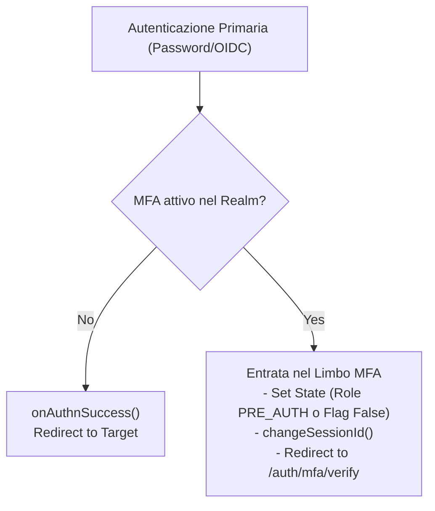

# Multi-Factor Authentication (MFA) - Architectural Proposals

Questa documentazione esplora diverse strategie per l'implementazione del secondo fattore di autenticazione in AAC. L'obiettivo è introdurre una verifica forte agendo come un layer di orchestrazione post-autenticazione, mantenendo l'agnosticismo rispetto agli Identity Provider (IdP) esistenti.

## 1. Analisi delle Strategie di Controllo

Si propongono due approcci distinti per gestire lo stato di "limbo" (utente autenticato al primo fattore, ma non ancora validato al secondo).

### Proposta A: Mutazione dei Ruoli (Approccio basato su Autorità)
Questa strategia prevede l'alterazione temporanea dei privilegi dell'utente.

- **Meccanismo**: Al superamento del primo fattore, vengono rimossi tutti i ruoli reali dell'utente e viene assegnato un unico ruolo transitorio (es. `ROLE_PRE_AUTH`).
- **Persistenza**: Poiché l'oggetto `Authentication` è immutabile, il token originale con le autorità reali deve essere salvato in una "cassaforte" (attributo di sessione `MFA_BACKUP_TOKEN`).
- **Controllo**: Il sistema nega l'accesso a ogni risorsa che richieda `ROLE_USER`, forzando l'utente verso l'OTP.
- **Sblocco**: Dopo la convalida, il token originale viene recuperato dalla sessione, aggiornato con le autorità definitive e ripristinato nel `SecurityContext`.

### Proposta B: Stato di Sessione (Approccio basato su Flag)
Questa strategia sposta il controllo dal livello dei permessi al livello dello stato della sessione.

- **Meccanismo**: L'utente mantiene i suoi ruoli reali (es. `ROLE_USER`) immediatamente dopo il primo fattore.
- **Stato**: Viene inserito un attributo booleano nella sessione HTTP (es. `MFA_AUTHENTICATED = false`).
- **Controllo**: Un filtro di sicurezza ("Il Vigile") intercetta le richieste. Se l'utente è autenticato ma il flag è `false`, l'accesso viene bloccato e l'utente reindirizzato all'OTP.
- **Sblocco**: Una volta validato il secondo fattore, il flag viene impostato su `true`. Non è necessaria alcuna mutazione dell'identità o ripristino di token.

---

## 2. Modelli di Verifica (Sistemi Ibridi)

Indipendentemente dalla strategia di controllo scelta (A o B), il sistema è progettato per essere agnostico rispetto al mezzo di verifica, supportando due modalità configurabili per Realm:

### MFA Interna (Managed by AAC)
- **Flusso**: AAC genera e invia un codice OTP via SMS o Email (configurati nel Realm).
- **Gestione**: AAC gestisce la validazione e l'eventuale "Trust this Device" tramite cookie persistenti per ottimizzare la UX.

### MFA Esterna (Delegated)
- **Flusso**: AAC delega la verifica a un provider esterno (es. Microsoft, Google).
- **Gestione**: Il provider esterno gestisce l'intero flusso di verifica e il riconoscimento del dispositivo fidato, rimandando ad AAC una conferma di successo.

---

## 3. Componenti Tecnici e Infrastruttura

### Il Filtro di Enforcement (MfaEnforcementFilter)
Il filtro agisce come imbuto prima dei controller. La sua logica è:
1. **Autenticazione**: L'utente è autenticato? $\to$ No: Prosegui (gestito da Spring).
2. **Policy**: Il Realm/Utente richiede MFA? $\to$ No: Prosegui.
3. **Stato**:
   - (Prop A): L'utente ha solo `ROLE_PRE_AUTH`? $\to$ Sì: **Blocca & Redirect**.
   - (Prop B): `MFA_AUTHENTICATED == false`? $\to$ Sì: **Blocca & Redirect**.

### Sicurezza e Robustezza
Per entrambe le proposte, vengono implementate le seguenti misure:

- **Session Fixation Protection**: Invocazione di `request.changeSessionId()` al passaggio nel limbo e al momento dello sblocco definitivo per prevenire il dirottamento della sessione.
- **Protezione Brute-Force**: Limite di tentativi per l'inserimento dell'OTP (es. max 3). Al superamento, la sessione viene invalidata.
- **Identity Spoofing Prevention**: Recupero del principal esclusivamente dal contesto protetto lato server, evitando l'uso di parametri HTTP manipolabili per la validazione.
- **Whitelist di Esenzione**: Definizione di rotte esenti dal filtro (pagina OTP, asset statici) per evitare loop di redirect.

---

## 4. Flussi Logici (Software Engineering)

### Flusso di Intercettazione (Post-Login)


### Flusso di Sblocco
```mermaid
flowchart TD
    REQ["Richiesta POST /auth/mfa/verify"] --> VAL_OTP{"Verifica OTP\n(Interno o Esterno)"}
    
    VAL_OTP -- Invalido --> KO["Errore / Blocco Brute-Force"]
    VAL_OTP -- Valido --> OK["Sblocco MFA\n- Update State (Restore Roles o Flag True)\n- changeSessionId()"]
    
    OK --> RED_HOME["Redirect finalizzato alla dashboard"]