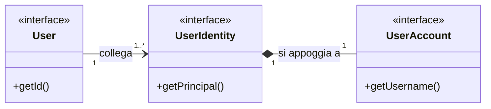
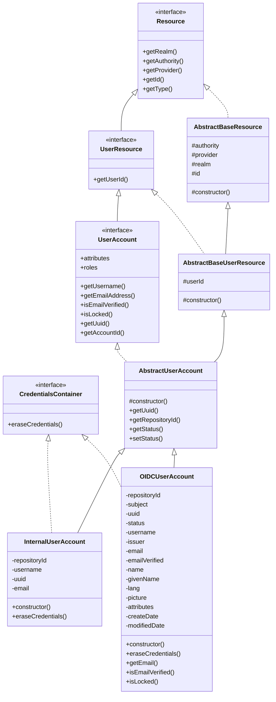
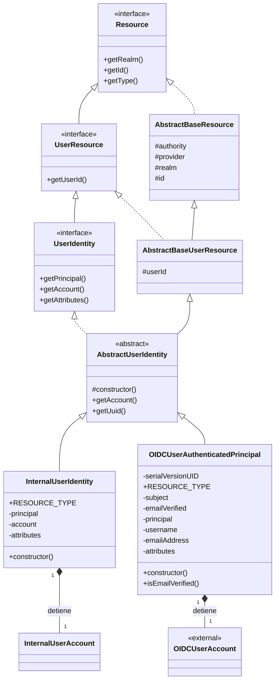

# Class Diagram

**Utente** (rappresentazione sia magari di un applicativo/server o, come in questo caso, un individuo)

*Relazione 1---n* **User Identity** (identità composte da ruoli, attributi, ID, ecc... di un determinato IdP)

*Relazione 1--1* **User Account** (informazioni che sono necessarie per l'autenticazione di un determinato User Identity)

Per comprovare che un `UserIdentity` sia effettivamente corretta nella fase di autenticazione si utilizzano i token. I token contengono dei claim che descrivono il **Principal** (l'utente autenticato) *[Il principal è lo User Account ridotto alla parte più stretta necessaria per la verifica]*, offrendo una vista dell'Account verificato grazie alla prova fornita all'IdP.

## Questo class diagram rappresenta

* **Account hierarchy:** Il contenitore delle credenziali usate per l'autenticazione (*"chi si autentica"*, ovvero ciò che serve al sistema per effettuare la verifica della tua identità attraverso una prova).
* **Identity hierarchy:** Rappresenta l'entità utente che può raggruppare e fornire contesto per l'autorizzazione (AuthZ) (*"chi sei nel sistema"*, ovvero l'insieme di attributi/ruoli/dati che rappresentano la tua identità in un determinato IdP).
* **Utente:** Rappresentazione della persona fisica o di un sistema (*"ciò che collega tutte le identità create dai vari IdP"*).

---

---

## Account Hierarchy (Internal + OIDC)

---

## Identity Hierarchy (Internal + OIDC)

