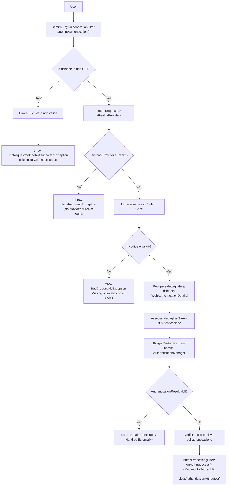

# Flowchart - Filtro di Autenticazione tramite Chiave di Conferma

Questo diagramma di flusso descrive la logica di controllo sequenziale applicata dal filtro di sicurezza `ConfirmKeyAuthenticationFilter` durante la fase di intercettazione di una richiesta di autenticazione. Il filtro si posiziona nella *Security Filter Chain* dell'applicazione e funge da guardiano per convalidare i prerequisiti della richiesta prima di delegare il processo di login vero e proprio.

## Validazione della Richiesta e Catena di Sicurezza

Il diagramma illustra i controlli di conformità del protocollo HTTP e la risoluzione del contesto di sicurezza prima del passaggio della mano all'architettura core di autenticazione, mostrando anche la gestione del ciclo post-autenticazione.

## Analisi Tecnica e Meccanismi di Controllo

* **Verifica del Metodo HTTP (Fail-Fast):** Il primo bivio condizionale (`La richiesta è una GET?`) applica una restrizione di protocollo fondamentale. Rifiutando immediatamente qualsiasi metodo diverso da `GET` con una `HttpRequestMethodNotSupportedException`, il sistema evita di allocare memoria per analizzare i parametri di richieste malformate o malevole.
* **Risoluzione Dinamica del Contesto (Multi-Tenancy):** Il recupero del Request ID (`Fetch Request ID`) serve a determinare il dominio di appartenenza della richiesta. Il controllo successivo (`Esistono Provider e Realm?`) garantisce che il sistema sappia esattamente contro quale database o Identity Provider (IdP) validare le credenziali. In caso negativo, il flusso si interrompe lanciando una `IllegalArgumentException`.
* **Isolamento della Logica di Autenticazione:** La validazione del codice di conferma (`Confirm Code`) rappresenta il vero e proprio controllo sulle credenziali *one-time*. Se il codice è assente o invalido, viene sollevata una `BadCredentialsException`. Se invece supera il controllo, il filtro non autentica direttamente l'utente, ma si limita a impacchettare il contesto (`WebAuthenticationDetails`) e a delegare la decisione finale all'`AuthenticationManager`. Questo approccio rispetta rigorosamente i pattern di design di Spring Security.
* **Gestione del Risultato e Lifecycle Post-Auth:** Una volta terminata l'elaborazione dell'AuthenticationManager, il filtro intercetta il risultato (`AuthenticationResult Null?`). Se l'oggetto è nullo, il flusso si interrompe lasciando che la catena continui. Se invece l'autenticazione è valida, il controllo passa alla logica di successo (`onAuthnSuccess ereditata o delegata all'abstract processing filter`). Questa fase esegue il reindirizzamento dell'utente verso l'URL finale di destinazione e invoca la pulizia dei dati temporanei di sessione (`clearAuthenticationAttributes()`), garantendo la sicurezza e l'idempotenza dello stato applicativo.
