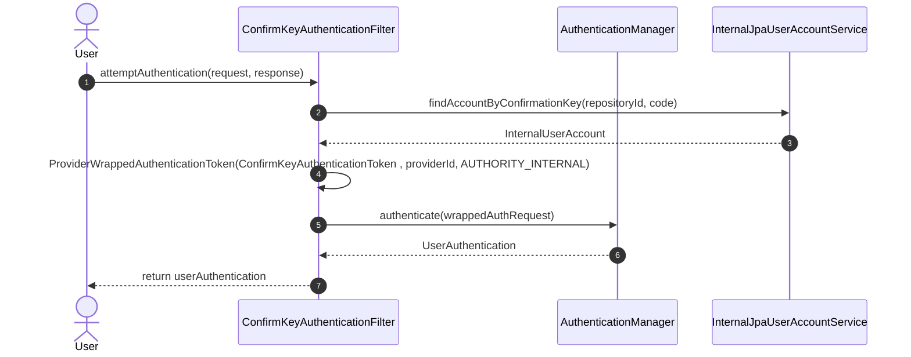

# Sequence Diagram - Flusso di Autenticazione tramite Chiave di Conferma

Questo diagramma di sequenza descrive la logica dinamica eseguita a runtime dal componente `ConfirmKeyAuthenticationFilter` per autenticare un utente tramite una chiave di conferma (*confirm key*). Il flusso mostra l'estrazione dei parametri di contesto dal protocollo HTTP, il recupero dell'account di dominio e la successiva delega al manager di sicurezza del framework.

## Ciclo di Intercettazione e Autenticazione della Richiesta

Il filtro intercetta la richiesta HTTP ed esegue l'orchestrazione dei token interagendo con lo strato di persistenza prima di passare il controllo al core di Spring Security.

---

## Analisi Tecnica dei Passaggi del Codice

L'analisi del codice sorgente evidenzia i seguenti passaggi chiave mappati all'interno della sequenza:

* **Risoluzione dell'Account di Dominio (Passi 2-3):** Il filtro delega la ricerca dell'identità all'`InternalJpaUserAccountService` (l'implementazione concreta dell'interfaccia service che interroga il database tramite JPA). Se l'account corrispondente alla chiave di conferma viene trovato, viene restituito l'oggetto `InternalUserAccount` per estrarne lo username, applicando una politica di *fail-fast* con lancio di `BadCredentialsException` in caso di esito nullo per evitare falle di sicurezza (*user enumeration leaks*).
* **Incapsulamento e Wrapping del Token (Passo 4):** Trovato l'account, il filtro esegue un'operazione interna creando il `ConfirmKeyAuthenticationToken` con lo username, per poi avvolgerlo nel `ProviderWrappedAuthenticationToken`. Questo passaggio serve a iniettare i metadati del provider, i dettagli del client HTTP (`WebAuthenticationDetails`) e l'autorità (`AUTHORITY_INTERNAL`) richiesti dall'architettura multi-tenant del sistema.
* **Delega ed Emissione del Contesto (Passi 5-6):** Il token configurato viene inoltrato all'`AuthenticationManager` globale di Spring Security tramite il metodo `authenticate()`. Il manager restituisce un oggetto `UserAuthentication` completamente autenticato e popolato, che il filtro rimanda indietro come valore di ritorno del metodo, permettendo al framework di depositarlo nel `SecurityContextHolder` e sbloccare l'accesso alla risorsa protetta.
