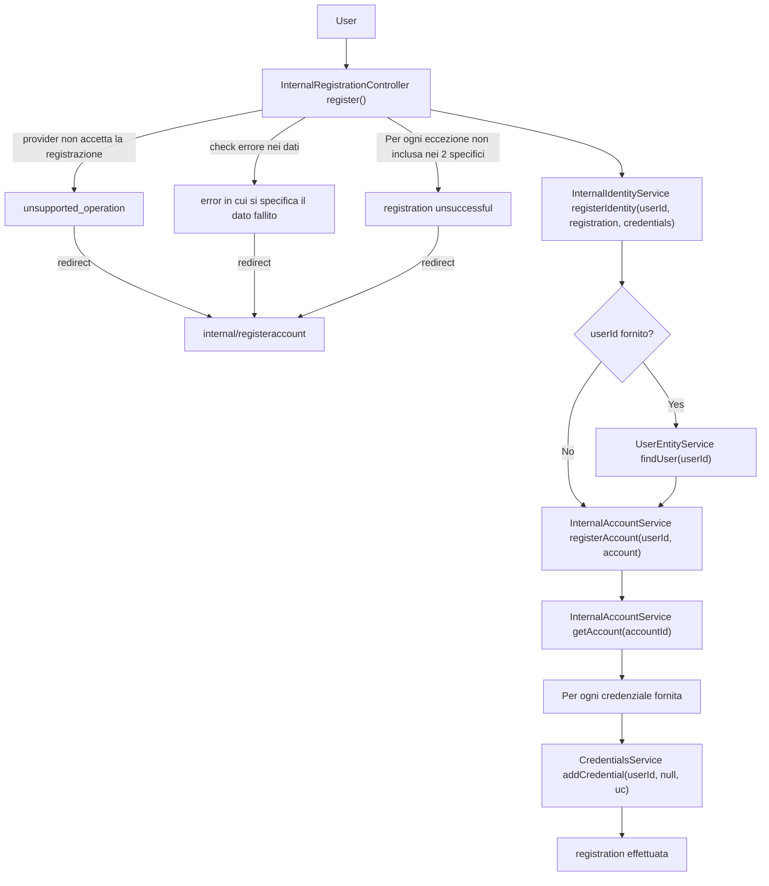

# Flowchart - Processo logico di registrazione

Questo diagramma di flusso descrive la logica di controllo, le verifiche condizionali e le politiche di gestione delle eccezioni applicate durante la fase di registrazione di una nuova identità. Il flusso evidenzia le strategie di *fail-fast* messe in atto dal controller per proteggere lo stato del sistema e i successivi bivi decisionali dei servizi di dominio.

## Flusso Decisionale e Gestione Errori

Il diagramma mappa sia i percorsi di successo (*happy path*) sia le deviazioni causate da errori di validazione, eccezioni impreviste o vincoli di business del provider.

## Dettagli ed Analisi dei Bivi Logici

* **Strategia Anti-Errore nel Controller (Fail-Fast):** Il blocco iniziale mostra tre rami di gestione dell'errore ad alto livello. Se il provider rifiuta l'operazione (`unsupported_operation`), se i dati falliscono la validazione sintattica, o se si verifica un'eccezione non prevista (`registration unsuccessful`), il sistema interrompe immediatamente l'esecuzione e reindirizza l'utente alla vista sicura (`internal/registeraccount`).
* **Risoluzione dell'Utente Esistente:** Se un `userId` è fornito, il sistema interroga l'`UserEntityService` per verificare l'esistenza dell'utente. Questo passaggio serve a determinare se l'utente è nuovo o se l'identità deve essere collegata a un profilo esistente, sebbene la creazione effettiva dell'account sia delegata all'`InternalAccountService`.
* **Gestione delle Credenziali:** A differenza della gestione dell'account, le credenziali vengono processate in modo iterativo. Per ogni credenziale fornita nella richiesta di registrazione, il sistema identifica il servizio di credenziali appropriato (es. Password) e invoca `addCredential`, associando la nuova credenziale all'ID utente risolto.
