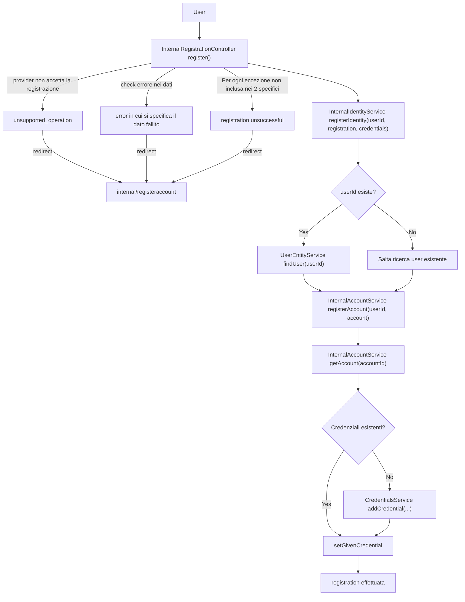

# Flowchart - Processo logico di registrazione

Questo diagramma di flusso descrive la logica di controllo, le verifiche condizionali e le politiche di gestione delle eccezioni applicate durante la fase di registrazione di una nuova identità. Il flusso evidenzia le strategie di *fail-fast* messe in atto dal controller per proteggere lo stato del sistema e i successivi bivi decisionali dei servizi di dominio.

## Flusso Decisionale e Gestione Errori

Il diagramma mappa sia i percorsi di successo (*happy path*) sia le deviazioni causate da errori di validazione, eccezioni impreviste o vincoli di business del provider.

## Dettagli ed Analisi dei Bivi Logici

* **Strategia Anti-Errore nel Controller (Fail-Fast):** Il blocco iniziale mostra tre rami di gestione dell'errore ad alto livello. Se il provider rifiuta l'operazione (`unsupported_operation`), se i dati falliscono la validazione sintattica, o se si verifica un'eccezione non prevista (`registration unsuccessful`), il sistema interrompe immediatamente l'esecuzione e reindirizza l'utente alla vista sicura (`internal/registeraccount`).
* **Risoluzione dell'Utente Esistente:** Prima di avviare la persistenza, il sistema esegue un controllo condizionale sull'ID utente (`userId esiste?`). Questo bivio permette di riutilizzare un'istanza di `UserEntity` esistente (nel caso di multi-identità collegate allo stesso utente) oppure di saltare la ricerca per procedere direttamente alla creazione di una nuova risorsa pulita.
* **Idempotenza e Aggiornamento delle Credenziali:** Nella fase finale, il sistema controlla la presenza di credenziali pregresse (`Credenziali esistenti?`). Se non sono presenti, viene invocato il ciclo di creazione sul `CredentialsService`; se invece esistono già, il sistema applica una logica di sovrascrittura o aggiornamento (`setGivenCredential`), garantendo l'idempotenza del processo di registrazione.
