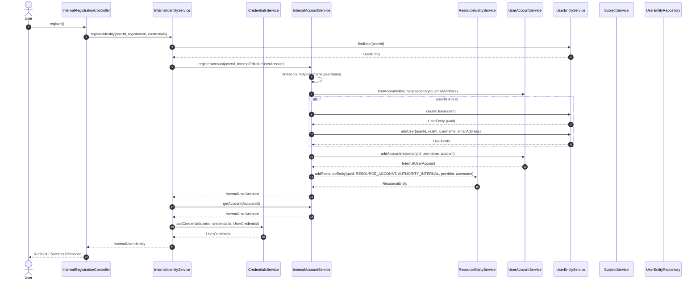

# Sequence Diagram

Questo diagramma di sequenza descrive la logica dinamica a runtime del sottosistema di Identity e Access Management (IAM) durante la fase di registrazione di un nuovo utente per l'IdP internal. Mostra come i servizi di dominio collaborano per garantire la consistenza dei dati tra l'utente globale (`UserEntity`), il suo account locale (`InternalUserAccount`) e le sue credenziali di autenticazione.

## Flusso di Orchestrazione della Registrazione

Il processo adotta un approccio **Facade** centralizzato tramite `InternalIdentityService`, che isola i singoli micro-servizi ed esegue le operazioni secondo una precisa sequenza transazionale.

## Dettagli e Pattern Architetturali del Flusso

* **Principio Subject-First:** Prima di agganciare credenziali o configurazioni specifiche dell'IdP, il sistema interagisce con il `SubjectService` per generare un **UUID globale** univoco (`generateUuid`). Questo assicura che l'identità dell'individuo esista a livello di core system in modo indipendente dai metodi di login scelti.
* **Verifiche di Unicità Preventiva:** All'interno del blocco `registerAccount`, l'account service effettua controlli incrociati (`findAccountById` e `findAccountsByEmail`) per scongiurare collisioni di identità o tentativi di account-takeover sul medesimo realm.
* **Separazione dei Cicli di Vita:** La persistenza dell'account e delle credenziali (`addCredential`) è nettamente separata. Questo permette al sistema di supportare in futuro flussi di registrazione "passwordless" o delegati a Identity Provider esterni senza dover modificare la logica di inizializzazione dell'account.
* **Modello di Risorsa Unificato:** Al termine della registrazione, l'entità creata viene registrata nel sistema tramite il `ResourceEntityService`. Questo pattern consente di trattare l'utente come una qualsiasi risorsa protetta dell'applicazione, abilitando logiche di controllo accessi (ACL) standardizzate.
