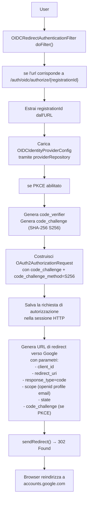
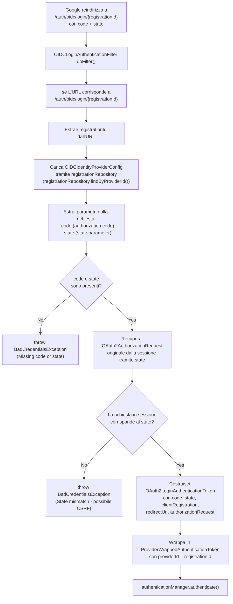
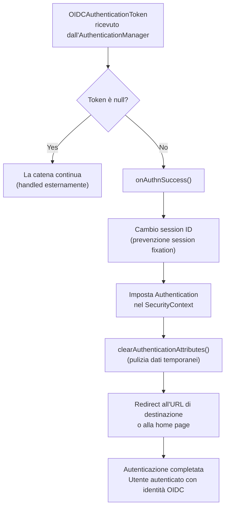

# Flowchart - Flusso di Autenticazione OIDC (Google IdP)

Questo diagramma di flusso descrive la logica di controllo sequenziale applicata durante il flusso di autenticazione OIDC tramite Google come Identity Provider. Il processo coinvolge due filtri principali nella Security Filter Chain: `OIDCRedirectAuthenticationFilter` (fase di inizio) e `OIDCLoginAuthenticationFilter` (fase di callback), con delega all'`OIDCAuthenticationProvider` per lo scambio del codice e la creazione dell'identità utente.

## Fase 1: Inizio del Flusso - Redirect verso Google

---

## Fase 2: Callback da Google - Ricezione del Codice

## Fase 3: Scambio Codice per Token e Creazione Identità

```mermaid
flowchart TD
    AUTHMGR["OIDCAuthenticationProvider doAuthenticate()"] --> SUPPORTS{"Il token è supportato?\n(OIDCAuthenticationToken)"}

    SUPPORTS -- No --> UNSUPPORTED["throw UnsupportedAuthenticationException"]

    SUPPORTS -- Yes --> CONFIG["Usa OIDCIdentityProviderConfig\niniettato nel provider"]

    CONFIG --> OIDCP["Delega a OidcAuthorizationCodeAuthenticationProvider\n(Spring Security)"]
    OIDCP --> EXCHANGE["Scambio del codice:\nPOST /oauth2/token\ncon code + code_verifier (se PKCE)"]

    EXCHANGE --> TOKENS["Ricevi dalla risposta:\n- access_token\n- id_token\n- refresh_token (opzionale)"]

    TOKENS --> IDTOKEN["Recupera attributi utente\n(chiamata a /userinfo via OidcUserService)"]

    IDTOKEN --> ATTRIB["Attributi utente:\n- sub (subject identifier)\n- email\n- name\n- given_name\n- picture\n- locale\n- email_verified"]

    ATTRIB --> SUB{"Il subject (sub)\nè presente?"}

    SUB -- No --> NOSUB["throw BadCredentialsException\n(No subject found)"]

    SUB -- Yes --> FIND["accountService.findAccountById()\n(repositoryId, subject)"]

    FIND --> ACCT{Account trovato?}
    ACCT -- No --> PRINCIPAL_START["Inizio creazione\nOIDCUserAuthenticatedPrincipal"]
    ACCT -- Yes --> LOCKED{Account bloccato?}
 
    LOCKED -- Yes --> BLOCKED["throw OIDCAuthenticationException\n(account not available)"]
 
    LOCKED -- No --> PRINCIPAL_START

    PRINCIPAL_START --> EMAIL_LOGIC["Calcola emailVerified:\n1. Se claim 'email_verified' presente -> usa claim\n2. Altrimenti -> usa trustEmailAddress"]
 
    EMAIL_LOGIC --> ALWAYS_CHECK{"alwaysTrustEmailAddress\n= true?"}
    ALWAYS_CHECK -- Yes --> MARKVERIFIED["Forza emailVerified = true"]
    ALWAYS_CHECK -- No --> FINAL_STATUS["Mantiene valore calcolato"]

    MARKVERIFIED --> PRINCIPAL_FINAL["Finalizza Principal\ncon subject, username, email,\nemailVerified, attributes"]
    FINAL_STATUS --> PRINCIPAL_FINAL

    PRINCIPAL_FINAL --> EXPIRES{"respectTokenExpiration\n= true?"}

    EXPIRES -- Yes --> SETEXP["Imposta scadenza\nbasata sul token"]
    EXPIRES -- No --> NOEXP["Nessuna scadenza specifica"]

    SETEXP --> RESULT["Crea OIDCAuthenticationToken\ncon principal, authorities (ROLE_USER),\naccessToken, refreshToken, expiresAt"]
    NOEXP --> RESULT

    RESULT --> RETURN["Ritorna OIDCAuthenticationToken\nal AuthenticationManager"]
```

## Fase 4: Completamento dell'Autenticazione

## Analisi Tecnica e Meccanismi di Controllo

* **Risoluzione Dinamica del Provider:** Il primo bivio in entrambi i filtri identifica quale Identity Provider esterno utilizzare. Il `registrationId` (es. "google") è la chiave che collega la richiesta alla configurazione corretta (`OIDCIdentityProviderConfig`).

* **Protezione CSRF con State Parameter:** Il parametro `state` generato nella fase di redirect viene salvato nella sessione e verificato al callback. Qualsiasi discrepanza genera un errore `State mismatch`, prevenendo attacchi CSRF.

* **PKCE (Proof Key for Code Exchange):** Quando abilitato (default: true), il filtro genera un `code_verifier` casuale e il corrispondente `code_challenge` (SHA-256). Il verifier viene salvato nella sessione e inviato nello scambio del codice, proteggendo contro attacchi di intercettazione.

* **Delega a Spring Security:** L'`OIDCAuthenticationProvider` delega lo scambio del codice a `OidcAuthorizationCodeAuthenticationProvider`, riutilizzando la logica collaudata di Spring Security per la gestione dei token.

* **Estrazione Attributi e UserInfo**: Attualmente, AAC delega l'estrazione dell'identità a `OidcUserService` (Spring Security), che effettua una chiamata aggiuntiva all'endpoint `/userinfo` dell'IdP per recuperare gli attributi aggiornati. È presente un `TODO` nel codice (`OIDCAuthenticationProvider.java`) per implementare il parsing diretto dell' `id_token` (JWT) ed eliminare questa chiamata extra.

* **Gestione dell'Email e Verifica:** Il sistema determina lo stato di verifica dell'email seguendo una gerarchia di priorità:
    1. Se l'IdP fornisce il claim `email_verified`, viene utilizzato il suo valore.
    2. Se il claim è assente, viene utilizzato il valore di `trustEmailAddress` configurato nel provider.
    3. In ogni caso, se `alwaysTrustEmailAddress` è impostato a `true`, l'email viene forzatamente segnata come verificata, sovrascrivendo i passaggi precedenti.

* **Prevenzione Session Fixation:** Al completamento dell'autenticazione, il filtro cambia l'ID della sessione (`changeSessionId()`), prevenendo attacchi di session fixation.
