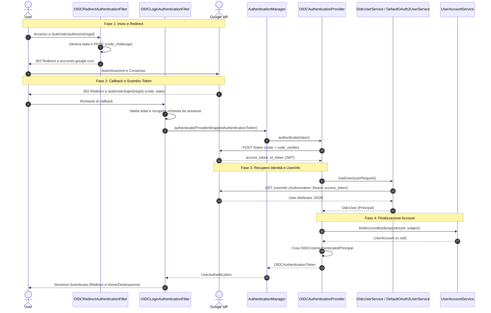

# Sequence Diagram - Flusso di Autenticazione OIDC (Google IdP)

Questo diagramma di sequenza descrive la logica dinamica eseguita a runtime per l'autenticazione di un utente tramite Google come Identity Provider (IdP). Il flusso illustra l'interazione tra i filtri di intercettazione di AAC, l'IdP esterno di Google e i componenti di sicurezza di Spring Security per lo scambio dei token e il recupero dell'identità.

## Ciclo di Autenticazione OIDC

Il processo è diviso in due fasi principali: l'iniziazione del redirect verso l'IdP e la gestione della callback per la creazione della sessione autenticata.

---

## Analisi Tecnica dei Passaggi del Codice

L'analisi del codice sorgente evidenzia i seguenti passaggi chiave mappati all'interno della sequenza:

* **Orchestrazione del Redirect (Passi 1-4):** Il `OIDCRedirectAuthenticationFilter` prepara l'ambiente di sicurezza generando un `state` per prevenire attacchi CSRF e un `code_challenge` per il protocollo PKCE, garantendo che solo il client che ha iniziato la richiesta possa completarla.
* **Validazione e Wrapping (Passi 5-8):** Al ritorno da Google, l'`OIDCLoginAuthenticationFilter` verifica l'integrità della sessione. Il token di autenticazione viene "avvolto" in un `ProviderWrappedAuthenticationToken` per trasportare i metadati del provider (come il `registrationId`) attraverso la catena di Spring Security.
* **Scambio Token e PKCE (Passi 9-10):** L'`OIDCAuthenticationProvider` esegue lo scambio server-to-server. L'invio del `code_verifier` è fondamentale: Google verifica che l'hash del verifier corrisponda al challenge inviato nella Fase 1, impedendo l'intercettazione del codice di autorizzazione.
* **Recupero Dinamico dell'Identità (Passi 11-13):** AAC utilizza una catena di delega (`OidcUserService` $\rightarrow$ `DefaultOAuth2UserService`). L'URI dell'endpoint `/userinfo` non è cablato, ma estratto a runtime dalla `ClientRegistration` contenuta nel `userRequest`. Questo permette a AAC di supportare più provider OIDC con la stessa logica.
* **Risoluzione dell'Account e Principal (Passi 14-18):** Una volta ottenuta l'identità certa da Google, il sistema interroga l'`UserAccountService` per verificare se l'utente esiste già nel database locale o se deve essere creato/associato. Il risultato finale è un `OIDCUserAuthenticatedPrincipal` che contiene tutte le claim e le autorità (ruoli) dell'utente.
